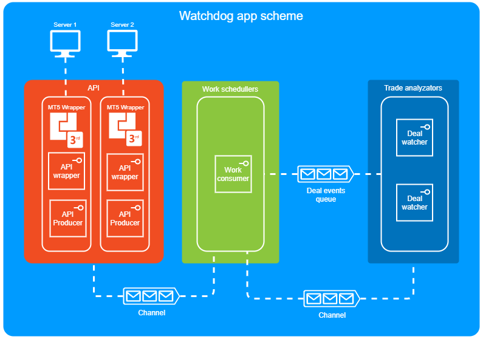

[](https://dev.azure.com/renatic/Trade%20watchdog/_build/latest?definitionId=1&branchName=master)

# Trading watchdog utility

A console application which monitors treading activity in real-time and log suspicious behavior.

Trading servers can have some restrictions, some users can try to bypass these restrictions by using multiple accounts with different names (of some relatives for example) and on multiple servers. We need to detect such behavior in real-time. Check new deals and if two or more similar deals exist, log the information. Similar deals are deals where open time differs no more than one second, currency pair is the same and the difference in volume-to-balance ratio is no more than 5%. If such deals are detected log info including accounts and servers where the deals were detected.

## Usage

Start new command line window with elevated privileges due to installation of performance counters.

```console
watchdog --server 0.0.0.0 --login 1 --password userpassword --ratio 5 --delta 1 --verbose
```

or

```console
watchdog -s 0.0.0.0 -l 1 -p userpassword -ratio 5 -delta 1 -verbose
```

## Performance counters

Windows performance counters are used for collecting performance metrics. There are 2 *Watchdog* perfomance counters:

- `Deal events from API to process` - Incoming deals queue counter

- `Deals to compare` - Work queue counter

## Development

### Scaling up and down

Scaling is possible via increasing/decreasing instances of components in [Watchdog.App/Startup.cs](src/Watchdog.App/Startup.cs) class.

variables:

- ConsumersCount
- WatchersCount

### Workflow scheme



## References

- **System.Threading.Channels** - high performance implementation of Producer/Consumer design pattern
[https://devblogs.microsoft.com/dotnet/an-introduction-to-system-threading-channels/](https://devblogs.microsoft.com/dotnet/an-introduction-to-system-threading-channels/)

- **IoC/DI container** - Microsoft.Extensions.DependencyInjection [https://docs.microsoft.com/en-us/aspnet/core/fundamentals/dependency-injection?view=aspnetcore-3.1](https://docs.microsoft.com/en-us/aspnet/core/fundamentals/dependency-injection?view=aspnetcore-3.1)

- **Serilog** - logging utility
[https://github.com/serilog/serilog/wiki/Configuration-Basics](https://github.com/serilog/serilog/wiki/Configuration-Basics)

- **Guard clauses** - simple package with guard clause extensions
[https://github.com/ardalis/guardclauses](https://github.com/ardalis/guardclauses)

- **Command Line Parser Library** - clean and concise API for manipulating command line arguments
[https://github.com/commandlineparser/commandline](https://github.com/commandlineparser/commandline)

- **FluentResults** - lightweight .NET library built to solve a common problem - returning an object indicates success or failure
[https://github.com/altmann/FluentResults](https://github.com/altmann/FluentResults)

- **Qoollo Performance Counters** - library for collecting and tracking performance metrics
[https://github.com/qoollo/performance-counters](https://github.com/qoollo/performance-counters)

- **Fluent Assertions** - more naturally specify the expected outcome of a TDD or BDD-style unit tests
[https://fluentassertions.com/](https://fluentassertions.com/)

- **BenchmarkDotNet** - powerfull library for benchmarking
[https://github.com/dotnet/BenchmarkDotNet](https://github.com/dotnet/BenchmarkDotNet)
